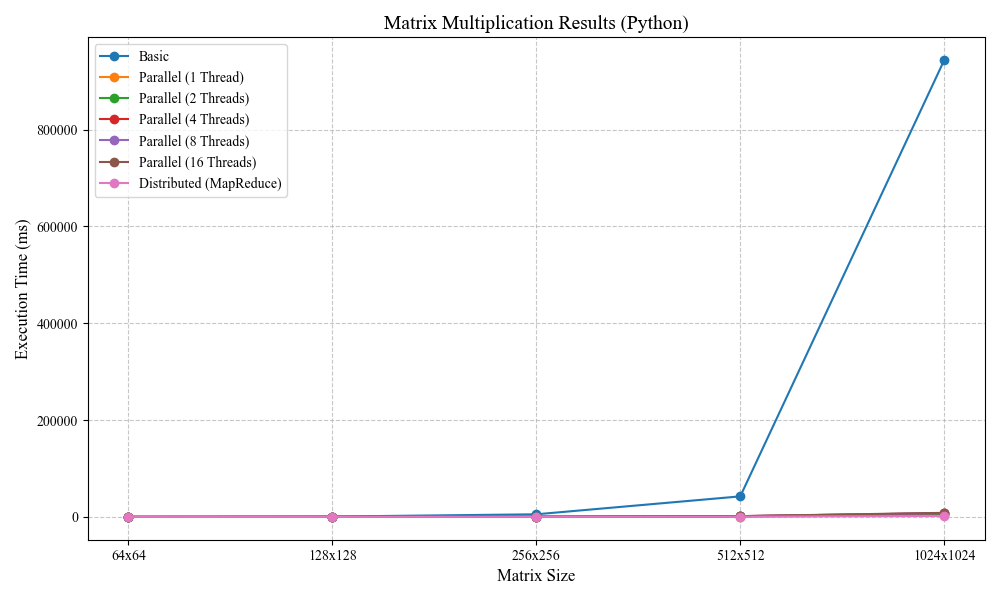
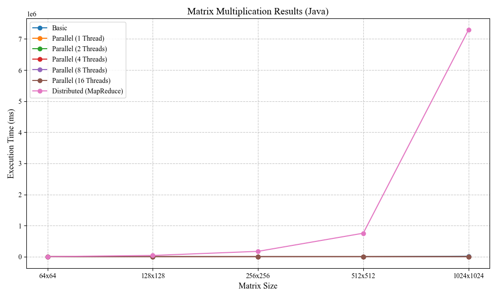

# **Distributed Matrix Multiplication and Frequent Item Set**

**Course:** Big Data (BD)  
**Degree:** Data Science and Engineering (GCID)  
**University:** University of Las Palmas de Gran Canaria (ULPGC)  
**Academic Year:** 2024 / 2025   
**Author:** Casimiro Torres, Kimberly

---

## **Execution Environment**

- **IDE Used:** IntelliJ IDEA (Java) and PyCharm (Python)
- **Operating System**: Windows 11 (Version 10.0, Architecture amd64)
- **CPU**: GenuineIntel 13th Gen Intel(R) Core(TM) i7-13700H
- **RAM:** 16 GB
- **System Manufacturer and Model:**
    - **Manufacturer:** HP
    - **Model:** Victus by HP Gaming Laptop 16-r0xxx
---

## **Overview**

This project addresses the implementation and evaluation of distributed approaches for matrix multiplication using MapReduce. It focuses on how different methods can efficiently handle matrices of increasing sizes, enabling the analysis of performance and scalability of the implemented algorithms. Additionally, as an optional extension, the frequent itemset mining problem is implemented using MapReduce, an essential approach in big data analysis.

Through this project, key concepts of distributed computing are explored, **basic**, **parallel**, and **distributed** approaches are compared, and the performance of these implementations is evaluated in Python and Java under different conditions.

---

## **Objectives**

### **1. Distributed Matrix Multiplication**

- Implement matrix multiplication using a distributed computing framework.

- Compare the distributed approach with both basic and parallel versions.

- Evaluate the solution on progressively larger matrices.

### **2. Frequent Item Set**

- Implement the frequent item set problem in a distributed way using MapReduce.

- Provide practical examples and evaluate performance.

---
# <u>**Matrix Multiplication**</u>

## **Code Structure**

### Python

``` bash
    Python/
    ├── benchmark/
    │   └── benchmark_matrix_multiplication.py
    ├── matrix/
    │   ├── basic_matrix_multiplication.py
    │   ├── mapreduce_matrix_multiplication.py
    │   └── parallel_matrix_multiplication.py
    ├── utils/
    │   └── matrix_generator.py
    ├── benchmark_results.json 
    └── requirements.txt
```

#### Java

``` bash
    Java/
    ├── src/
    │   └── main/
    │      └── java/
    │          └── org/ulpgc/
    │              ├── benchmark/
    │              │   └── BenchmarkMatrixMultiplication.py
    │              ├── matrix/
    │              │   ├── basic/
    │              │   │   └── BasicMatrixMultiplication.java
    │              │   ├── mapreduce/
    │              │   │   └── MapReduceMatrixMultiplication.java
    │              │   └── parallel/
    │              │       └── ParallelMatrixMultiplication.java
    │              └── utils/
    │                  └── MatrixGenerator.java     
    ├── benchmark_results.json
    └── pom.xml
```

---

## **Implementation**

### **Matrix Multiplication Approaches**

Three distinct approaches were implemented to perform matrix multiplication, each leveraging a unique computational paradigm to achieve efficient processing for matrices of varying sizes.

| **Approach**   | **Description**                                                     | **Framework / Library Used**                         |
|-----------------|---------------------------------------------------------------------|------------------------------------------------------|
| **Basic**       |Sequential multiplication with O(n³) complexity.| None                                                 |
| **Parallel**    | Multi-threaded multiplication optimized for shared memory systems. | Python's `ThreadPoolExecutor`, Java's `ForkJoinPool` |
| **Distributed** | Matrix multiplication distributed over multiple nodes using MapReduce. | Python's `MRJob`, Java's `Hadoop` API                |

---

## **Performance Evaluation**

### **Benchmarks for Matrix Multiplication**

#### Python Results

| Matrix Size | Basic    | Parallel (1 Thread) | Parallel (2 Threads) | Parallel (4 Threads) | Parallel (8 Threads) | Parallel (16 Threads) | Distributed (MapReduce) |
|-------------|----------|---------------------|-----------------------|----------------------|----------------------|-----------------------|--------------------------|
| 64x64       | 84.45    | 5.56                | 9.10                  | 15.67                | 16.51                | 17.93                 | 33.82                   |
| 128x128     | 680.89   | 18.74               | 41.97                 | 69.73                | 68.71                | 71.70                 | 53.13                   |
| 256x256     | 5349.04  | 83.01               | 177.43                | 290.61               | 302.12               | 286.37                | 128.05                  |
| 512x512     | 42370.69 | 629.15              | 1322.14               | 1496.99              | 1489.82              | 1555.72               | 454.01                  |
| 1024x1024   | 943263.05| 3879.63             | 5019.40               | 7766.93              | 7698.75              | 8387.69               | 1851.64                 |


#### Java Results

| Matrix Size | Basic   | Parallel (1 Thread) | Parallel (2 Threads) | Parallel (4 Threads) | Parallel (8 Threads) | Parallel (16 Threads) | Distributed (MapReduce) |
|-------------|---------|---------------------|-----------------------|----------------------|----------------------|-----------------------|--------------------------|
| 64x64       | 0.20    | 0.40                | 0.51                  | 0.78                 | 1.41                 | 3.47                  | 3369.28                 |
| 128x128     | 1.70    | 0.93                | 1.03                  | 0.84                 | 1.49                 | 3.01                  | 40859.80                |
| 256x256     | 17.69   | 7.21                | 3.93                  | 2.81                 | 2.20                 | 2.98                  | 172394.61               |
| 512x512     | 172.58  | 58.79               | 30.25                 | 15.75                | 9.86                 | 7.59                  | 755736.19               |
| 1024x1024   | 16328.77| 483.27              | 243.32                | 124.33               | 73.88                | 48.74                 | 7291218.74              |

---

### **Visual Performance Analysis**

#### Python Results



#### Java Results



---

The comparative results between the Python and Java implementations for matrix multiplication reveal significant differences in execution times. Interestingly, the highest execution times are observed in the distributed implementation (MapReduce) in Java, especially as the matrix size increases. This could be attributed to additional overhead in the distributed system setup or resource handling in Hadoop. In Python, while execution times also increase with matrix size, the distributed implementation appears to be more efficient compared to the times recorded in Java.

Furthermore, parallel implementations in both languages stand out for their efficiency compared to the basic approach. However, in Java, the times for parallel implementations are consistently lower than in Python, demonstrating greater optimization in resource and thread management. For smaller matrices, Java provides much faster times across all approaches, but as matrix sizes grow, Python's implementation exhibits more stable behavior, especially in approaches like MapReduce. This highlights how the choice of language and methodology significantly impacts scalability and overall performance.

---

## **Conclusion**

In conclusion, the results obtained demonstrate how each approach and programming language has its strengths and limitations, allowing for an evaluation of key factors such as scalability, network overhead, and resource utilization. The basic approach, while simple and easy to implement, is significantly slower and suitable only for small matrices. However, it provides an essential baseline for assessing the impact of matrix size on performance, serving as a foundation for comparisons with more advanced methods.

Parallel approaches showed a considerable improvement in execution time by leveraging multiple threads, particularly in Java, which optimizes memory and processor usage more effectively in a shared-memory environment. In contrast, the distributed approach (MapReduce) proved to be the most efficient for handling large matrices, where its ability to distribute workloads across nodes successfully addressed scalability challenges. However, its initial overhead and data transfer times impacted its performance for smaller matrices. Additionally, Python exhibited greater stability in handling distributed matrices, while Java excelled in managing parallel computations, maximizing performance for small and medium-sized matrices.

This project also evaluated how efficient use of resources, such as memory and processing nodes, influences the results. MapReduce stood out for its ability to distribute workloads across multiple nodes, albeit with higher network costs, while parallel methods made better use of resources in local environments. In summary, the choice of method and programming language depends on the context and specific requirements, demonstrating that combining algorithmic strategies with advanced technologies allows for effectively addressing the challenges of processing large data volumes and ensuring scalability in distributed and parallel environments.

---

# <u>**Frequent Item Set**</u>

Frequent item set analysis is essential in data mining as it identifies patterns and relationships between elements in large datasets. With the exponential growth of information, traditional approaches face limitations, making the use of paradigms like MapReduce necessary.

This project leverages MapReduce to efficiently and scalably identify frequent item sets. This approach optimizes the analysis of large-scale data, ensuring accuracy and enabling the discovery of valuable patterns for data-driven decision-making.

---

## **Code Structure**

#### Java

``` bash
    FrequentItemSet/
    ├── src/
    │   └── main/
    │       ├── java/
    │       │   └── org/ulpgc/
    │       │       └── FrequentItemSet.java
    │       └── resources/
    │           ├── input1.txt
    │           ├── input2.txt
    │           └── input3.txt
    └── pom.xml
```

---

## **Inputs and Configuration**

### **Inputs**

The algorithm processes datasets where each line represents a transaction. Transactions consist of items separated by spaces or commas. These inputs enable the identification of frequent item sets based on their co-occurrence in transactions.

### **Configuration**

- **k (Item set size):** Determines the size of the item sets to analyze. For instance, k=2 focuses on pairs of items, while higher values analyze larger combinations.
- **min_frequency:** Specifies the minimum frequency for an item set to be considered frequent. Item sets with occurrences below this threshold are excluded from the results.

### **Execution Parameters**

The project requires four key arguments to execute:

- **Input Path:** Path to the file or directory containing the transaction dataset.
- **Output Path:** Path where the results will be stored.
- **k:** Size of the item sets to generate and analyze.
- **min_frequency:** Minimum frequency threshold for item sets.

### **Usage Example**

To execute the program from your development environment configuration, follow these steps:

1. Go to the **Run/Debug Configurations** section.
2. Set the following parameters:
   - **Main class:** `org.ulpgc.FrequentItemSet`
   - **Program arguments:** `src/main/resources/input1.txt output 1 1`
   - **Working directory:** The base path of your project.
3. Save the configuration and click **Run**.

This command takes the input file `input1.txt`, generates the results in the `output` directory, and uses the parameters `k=1` and `min_frequency=1`.

---

## **Experiments**

### **Input1.txt**

#### **Data**

| Items         | 
|---------------|
| A  B  C  D    |
| A  B  D  E  F |
| A  C  F       |
| B  E  F  G    |
| B  D  E  F    |
| B  E  G       |

### **Input 1 Results for k=1 (min_frequency = 1)**

| 1-Itemset | Frequency |
|-----------|-----------|
| A         | 3         |
| B         | 5         |
| C         | 2         |
| D         | 3         |
| E         | 4         |
| F         | 4         |
| G         | 2         |

### **Input 1 Results for k=2 (min_frequency = 3)**

| 2-Itemset | Frequency |
|-----------|-----------|
| B - D     | 3         |
| B - E     | 4         |
| B - F     | 3         |
| E - F     | 3         |

### **Input 1 Results for k=3 (min_frequency = 3)**

| 3-Itemset | Frequency |
|-----------|-----------|
| B - E - F | 3         |

---

### **Input2.txt**

#### **Data**

| Items                        | 
|------------------------------|
| apple  banana  orange        |
| apple  banana  strawberry    |
| apple  banana  pineapple     |
| apple  banana  lemon         |
| apple  banana  cherry        |
| apple  orange  strawberry    |
| apple  orange  pineapple     |
| apple  orange  lemon         |
| apple  orange  cherry        |
| apple  strawberry  pineapple |
| apple  strawberry  lemon     |


### **Input 2 Results for k=1 (min_frequency = 1)**

| 1-Itemset   | Frequency |
|-------------|-----------|
| apple       | 11        |
| banana      | 5         |
| cherry      | 2         |
| lemon       | 3         |
| orange      | 5         |
| pineapple   | 3         |
| strawberry  | 4         |

### **Input 2 Results for k=2 (min_frequency = 2)**

| 2-Itemset         | Frequency |
|-------------------|-----------|
| apple  banana     | 5         |
| apple  cherry     | 2         |
| apple  lemon      | 3         |
| apple  orange     | 5         |
| apple  pineapple  | 3         |
| apple  strawberry | 4         |

---

### **Input3.txt**

#### **Data**

| Items                      | 
|----------------------------|
| Action  Adventure  Sci-Fi  |
| Adventure  Sci-Fi  Fantasy |
| Action  Sci-Fi             |
| Adventure  Drama  Fantasy  |
| Action  Drama  Adventure   |
| Drama  Fantasy  Adventure  |
| Sci-Fi  Action  Adventure  |
| Fantasy  Adventure  Sci-Fi |
| Drama  Sci-Fi  Action      |
| Adventure  Sci-Fi  Action  |

### **Input 3 Results for k=3 (min_frequency = 2)**

| 3-Itemset                   | Frequency |
|-----------------------------|-----------|
| Action  Adventure  Sci-Fi   | 3         |
| Adventure  Drama  Fantasy   | 2         |
| Adventure  Fantasy  Sci-Fi  | 2         |

---

## **Conclusion**

Frequent item set analysis using the MapReduce paradigm has proven to be an efficient and scalable tool for processing large volumes of data. Through this project, it has been demonstrated how different configurations of set sizes (k) and minimum frequencies allow the approach to be tailored to the specific needs of the analysis.

The results obtained reveal valuable patterns in diverse datasets, highlighting important relationships between elements that would otherwise be difficult to identify. This approach not only optimizes performance in terms of distributed processing but also ensures greater adaptability to address real-world problems in data mining.

In summary, the implementation of algorithms like this in distributed environments is essential for fully leveraging the potential of data, providing insights that are key for informed decision-making across various fields.

---

## **GitHub Link** 🔗

All the code implemented for this project can be found on my GitHub repository at the following link: [GitHub Repository](https://github.com/Kimberlycasimiro/Task4_Matrix_Multiplication.git).
